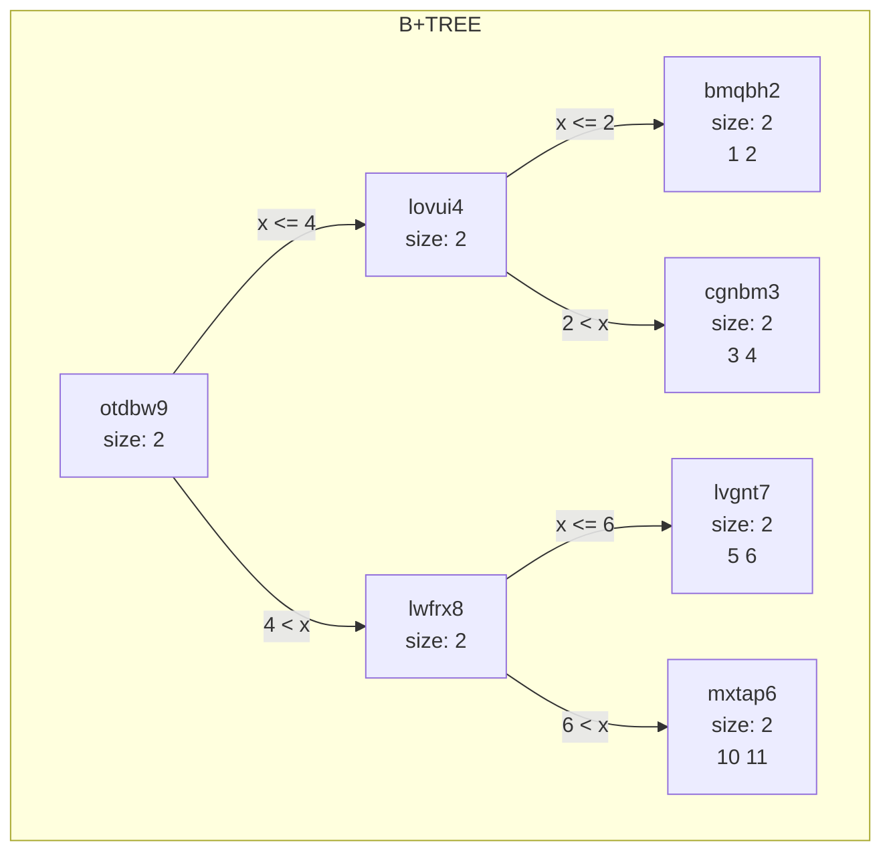
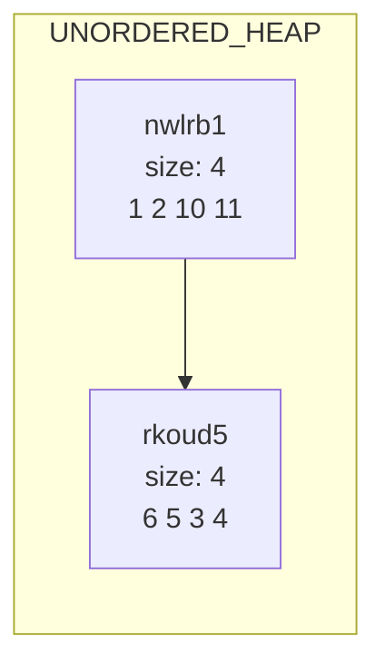

```mermaid
graph TD
subgraph B+TREE
otdbw9[otdbw9<br/>size: 2<br/>]
lovui4[lovui4<br/>size: 2<br/>]
bmqbh2[bmqbh2<br/>size: 2<br/>1 2 ]
lovui4-->|x <= 2|bmqbh2
cgnbm3[cgnbm3<br/>size: 2<br/>3 4 ]
lovui4-->|2 < x|cgnbm3
otdbw9-->|x <= 4|lovui4
lwfrx8[lwfrx8<br/>size: 2<br/>]
lvgnt7[lvgnt7<br/>size: 2<br/>5 6 ]
lwfrx8-->|x <= 6|lvgnt7
mxtap6[mxtap6<br/>size: 2<br/>10 11 ]
lwfrx8-->|6 < x|mxtap6
otdbw9-->|4 < x|lwfrx8
end
```

```mermaid
graph LR
subgraph UNORDERED_HEAP
nwlrb1[nwlrb1<br/>size: 4<br/>1 2 10 11 ]
rkoud5[rkoud5<br/>size: 4<br/>6 5 3 4 ]
nwlrb1-->rkoud5
end
```
