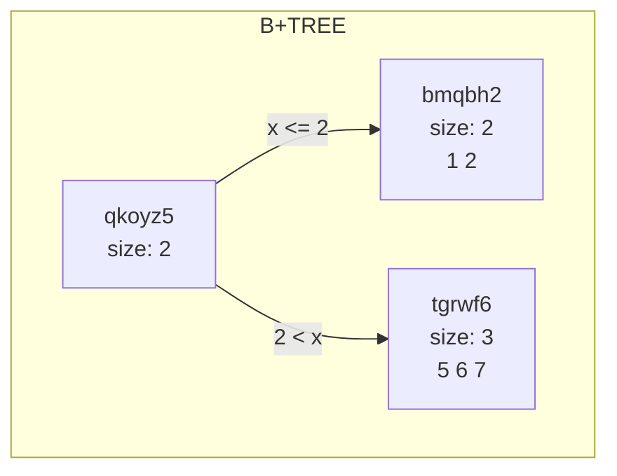
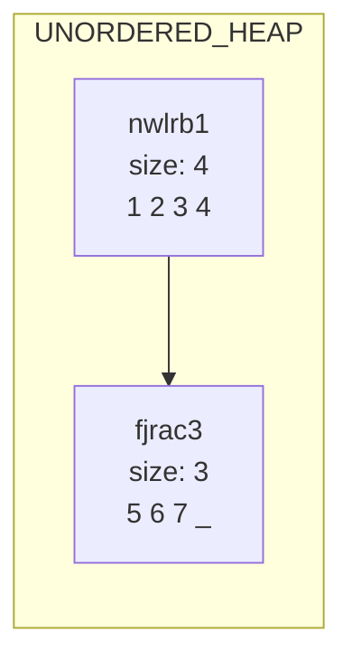

```mermaid
graph TD
subgraph B+TREE
qkoyz5[qkoyz5<br/>size: 2<br/>]
bmqbh2[bmqbh2<br/>size: 2<br/>1 2 ]
qkoyz5-->|x <= 2|bmqbh2
tgrwf6[tgrwf6<br/>size: 3<br/>5 6 7 ]
qkoyz5-->|2 < x|tgrwf6
end
```

```mermaid
graph LR
subgraph UNORDERED_HEAP
nwlrb1[nwlrb1<br/>size: 4<br/>1 2 3 4 ]
fjrac3[fjrac3<br/>size: 3<br/>5 6 7 _ ]
nwlrb1-->fjrac3
end
```
