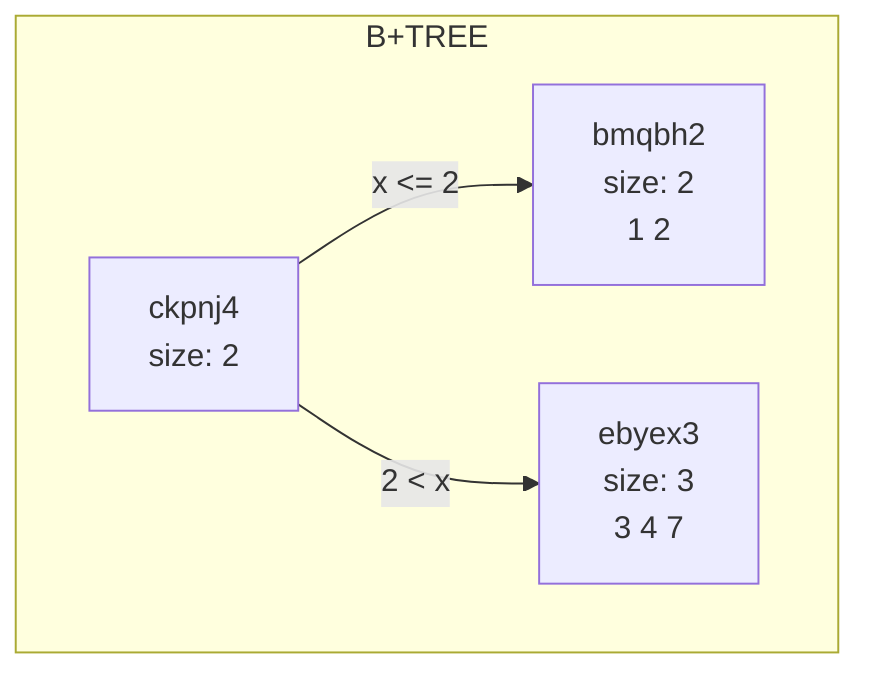
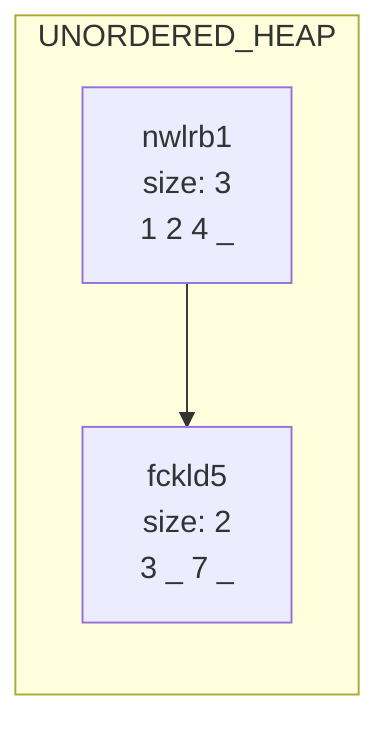

```mermaid
graph TD
subgraph B+TREE
ckpnj4[ckpnj4<br/>size: 2<br/>]
bmqbh2[bmqbh2<br/>size: 2<br/>1 2 ]
ckpnj4-->|x <= 2|bmqbh2
ebyex3[ebyex3<br/>size: 3<br/>3 4 7 ]
ckpnj4-->|2 < x|ebyex3
end
```

```mermaid
graph LR
subgraph UNORDERED_HEAP
nwlrb1[nwlrb1<br/>size: 3<br/>1 2 4 _ ]
fckld5[fckld5<br/>size: 2<br/>3 _ 7 _ ]
nwlrb1-->fckld5
end
```
