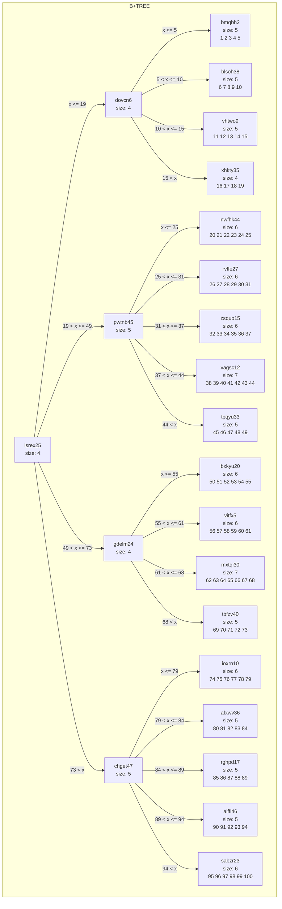

```mermaid
graph TD
subgraph B+TREE
isrex25[isrex25<br/>size: 4<br/>]
dovcn6[dovcn6<br/>size: 4<br/>]
bmqbh2[bmqbh2<br/>size: 5<br/>1 2 3 4 5 ]
dovcn6-->|x <= 5|bmqbh2
blsoh38[blsoh38<br/>size: 5<br/>6 7 8 9 10 ]
dovcn6-->|5 < x <= 10|blsoh38
vhtwo9[vhtwo9<br/>size: 5<br/>11 12 13 14 15 ]
dovcn6-->|10 < x <= 15|vhtwo9
xhkty35[xhkty35<br/>size: 4<br/>16 17 18 19 ]
dovcn6-->|15 < x|xhkty35
isrex25-->|x <= 19|dovcn6
pwtnb45[pwtnb45<br/>size: 5<br/>]
nwfhk44[nwfhk44<br/>size: 6<br/>20 21 22 23 24 25 ]
pwtnb45-->|x <= 25|nwfhk44
rvffe27[rvffe27<br/>size: 6<br/>26 27 28 29 30 31 ]
pwtnb45-->|25 < x <= 31|rvffe27
zsquo15[zsquo15<br/>size: 6<br/>32 33 34 35 36 37 ]
pwtnb45-->|31 < x <= 37|zsquo15
vagsc12[vagsc12<br/>size: 7<br/>38 39 40 41 42 43 44 ]
pwtnb45-->|37 < x <= 44|vagsc12
tpqyu33[tpqyu33<br/>size: 5<br/>45 46 47 48 49 ]
pwtnb45-->|44 < x|tpqyu33
isrex25-->|19 < x <= 49|pwtnb45
gdelm24[gdelm24<br/>size: 4<br/>]
bxkyu20[bxkyu20<br/>size: 6<br/>50 51 52 53 54 55 ]
gdelm24-->|x <= 55|bxkyu20
vitfx5[vitfx5<br/>size: 6<br/>56 57 58 59 60 61 ]
gdelm24-->|55 < x <= 61|vitfx5
mxtqi30[mxtqi30<br/>size: 7<br/>62 63 64 65 66 67 68 ]
gdelm24-->|61 < x <= 68|mxtqi30
tbfzv40[tbfzv40<br/>size: 5<br/>69 70 71 72 73 ]
gdelm24-->|68 < x|tbfzv40
isrex25-->|49 < x <= 73|gdelm24
chget47[chget47<br/>size: 5<br/>]
ioxrn10[ioxrn10<br/>size: 6<br/>74 75 76 77 78 79 ]
chget47-->|x <= 79|ioxrn10
afxwv36[afxwv36<br/>size: 5<br/>80 81 82 83 84 ]
chget47-->|79 < x <= 84|afxwv36
rghpd17[rghpd17<br/>size: 5<br/>85 86 87 88 89 ]
chget47-->|84 < x <= 89|rghpd17
aiffi46[aiffi46<br/>size: 5<br/>90 91 92 93 94 ]
chget47-->|89 < x <= 94|aiffi46
sabzr23[sabzr23<br/>size: 6<br/>95 96 97 98 99 100 ]
chget47-->|94 < x|sabzr23
isrex25-->|73 < x|chget47
end
```

```mermaid
graph LR
subgraph UNORDERED_HEAP
nwlrb1[nwlrb1<br/>size: 4<br/>56 5 53 13 ]
jozfn3[jozfn3<br/>size: 4<br/>80 55 92 100 ]
nwlrb1-->jozfn3
sjhxc4[sjhxc4<br/>size: 4<br/>84 1 70 10 ]
jozfn3-->sjhxc4
xszqy7[xszqy7<br/>size: 4<br/>73 71 11 7 ]
sjhxc4-->xszqy7
mncye8[mncye8<br/>size: 4<br/>47 37 34 99 ]
xszqy7-->mncye8
bmwxs11[bmwxs11<br/>size: 4<br/>50 54 94 31 ]
mncye8-->bmwxs11
vpvuh13[vpvuh13<br/>size: 4<br/>25 60 36 32 ]
bmwxs11-->vpvuh13
tjuvh14[tjuvh14<br/>size: 4<br/>86 67 35 75 ]
vpvuh13-->tjuvh14
fceev16[fceev16<br/>size: 4<br/>27 79 45 26 ]
tjuvh14-->fceev16
bkfje18[bkfje18<br/>size: 4<br/>30 61 97 95 ]
fceev16-->bkfje18
heucz19[heucz19<br/>size: 4<br/>16 51 49 46 ]
bkfje18-->heucz19
rzmjt21[rzmjt21<br/>size: 4<br/>83 85 2 68 ]
heucz19-->rzmjt21
coxit22[coxit22<br/>size: 4<br/>42 9 76 96 ]
rzmjt21-->coxit22
sgwcg26[sgwcg26<br/>size: 4<br/>98 91 28 89 ]
coxit22-->sgwcg26
ykvvs28[ykvvs28<br/>size: 4<br/>14 39 48 18 ]
sgwcg26-->ykvvs28
opurq29[opurq29<br/>size: 4<br/>21 81 57 77 ]
ykvvs28-->opurq29
gycxd31[gycxd31<br/>size: 4<br/>15 44 65 64 ]
opurq29-->gycxd31
zrlwv32[zrlwv32<br/>size: 4<br/>58 38 40 4 ]
gycxd31-->zrlwv32
wyerv34[wyerv34<br/>size: 4<br/>23 17 82 88 ]
zrlwv32-->wyerv34
hcwkb37[hcwkb37<br/>size: 4<br/>6 72 8 52 ]
wyerv34-->hcwkb37
nhyfh39[nhyfh39<br/>size: 4<br/>12 41 78 69 ]
hcwkb37-->nhyfh39
aycms41[aycms41<br/>size: 4<br/>24 93 43 33 ]
nhyfh39-->aycms41
dmxai42[dmxai42<br/>size: 4<br/>19 62 3 59 ]
aycms41-->dmxai42
vimtu43[vimtu43<br/>size: 4<br/>29 63 22 90 ]
dmxai42-->vimtu43
yjhyk48[yjhyk48<br/>size: 4<br/>87 20 66 74 ]
vimtu43-->yjhyk48
end
```
